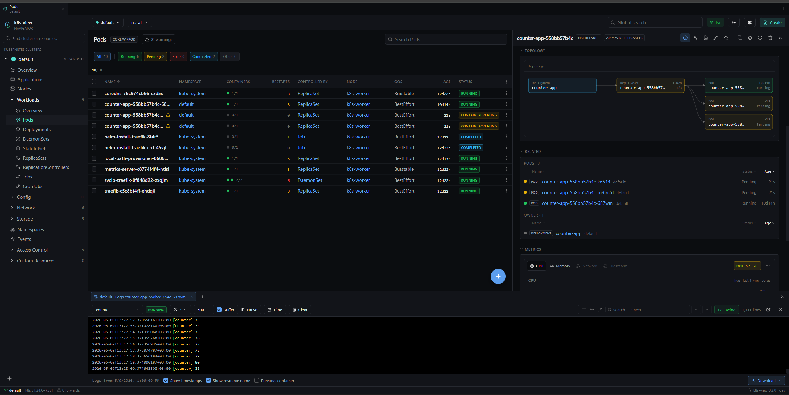

# k8s-view

**A streaming, multi-cluster Kubernetes dashboard. Single binary. Apache-2.0.**



`k8s-view` is a self-hosted Kubernetes UI built on a strict streaming model:
every resource list in the browser is fed by a `client-go` shared informer on
the backend and pushed to the frontend as binary MessagePack deltas over a
single WebSocket. **No polling. No pagination.** A 100 000-pod namespace
scrolls at 60 fps because both ends are virtualised.

The same binary serves the React UI, the REST API, the streaming WebSocket
and the long-lived `exec`/`logs`/`port-forward` channels. Drop it on a host,
point it at a kubeconfig, and you're done.

| | |
|---|---|
| **Latest release** | `v0.3.0` |
| **License** | Apache-2.0 |
| **Image** | `ghcr.io/beztebya666/k8s-view:0.3.0` |
| **Build** | Go 1.22 + Node 20 |
| **Compatible with** | Kubernetes 1.20 → 1.36 (`client-go` v0.31, dynamic discovery) |

---

## Table of contents

- [Features](#features)
- [Quick start](#quick-start)
  - [Single binary](#single-binary)
  - [Docker](#docker)
  - [Kubernetes (Helm)](#kubernetes-helm)
  - [Kubernetes (raw manifests)](#kubernetes-raw-manifests)
- [Configuration](#configuration)
  - [CLI flags & environment variables](#cli-flags--environment-variables)
  - [Authentication](#authentication)
  - [Multi-cluster](#multi-cluster)
  - [Distributed mode](#distributed-mode)
- [RBAC](#rbac)
- [API surface](#api-surface)
- [Observability](#observability)
- [Architecture](#architecture)
- [Building from source](#building-from-source)
- [Development](#development)
- [Security model](#security-model)
- [Troubleshooting](#troubleshooting)
- [Versioning & release policy](#versioning--release-policy)
- [License](#license)

---

## Features

**Real-time view of every resource type.**
- Watch streams from the API server are forwarded to the browser as binary
  MessagePack deltas. Status changes appear in single-digit milliseconds.
- One shared informer per `(cluster, GVR)` is multiplexed to all subscribers,
  so 50 open browser tabs cost the cluster the same as 1.
- Built-in resources, CRDs, and any GVR the discovery client surfaces are
  rendered the same way (list, detail, YAML edit, events, actions).
- Per-resource warning sort: anything with a structural problem (failed
  pull, crashloop, exit code, ProgressDeadlineExceeded, drained node, …)
  bubbles to the top of every list with a clickable warning chip that
  opens a verbatim cause tooltip.

**Side-panel inline actions — operate without ever opening a terminal.**
- Open any pod, deployment, statefulset, daemonset, replicaset, job or
  cronjob in the right side-panel and trigger the most common kubectl
  verbs from a single icon strip:
  - **Scale** with a slider modal (Lens-style current/target readout).
  - **Rollout restart** (`kubectl rollout restart` equivalent — patches
    the template's `restartedAt` annotation, pods recycle gradually).
  - **Rollout history & one-click rollback** for Deployments — every
    owned ReplicaSet listed with image, replica counts and age; rollback
    is gated by a side-by-side server-side YAML diff confirmation
    (`kubectl rollout undo --to-revision=N` equivalent). `change-cause`
    annotation is opt-in via a per-device toggle.
  - **kubectl-describe** view with full event propagation across owners
    and pods, plus a sortable **Related objects** panel (Name / Status /
    Age columns; sort preference persists per device).
  - **Trigger now** for CronJob (creates a one-shot Job from the
    `jobTemplate`) and **Suspend / Resume** for the schedule itself.
  - **Edit YAML** in a Monaco editor with a "Review diff" step before
    server-side apply; **Delete** with a confirm modal (foreground /
    background propagation, force option).
  - **Copy kubectl** popover that emits a context-prefixed command for
    `get -o yaml`, `describe`, `logs`, `exec`, `port-forward`, etc.
  - **Pin to favourites** so the resource appears in the sidebar across
    every cluster tab.

**Pod sessions in the bottom workspace pane.**
- Independent tabs for **logs**, **exec** (interactive xterm.js shell),
  **attach** to a running container, **port-forward**, **edit YAML**, and
  **create from template** — they survive page navigation.
- Logs panel: multi-container selection, server-side initial tail (50 →
  20 000 lines), in-browser ring with a **Buffer** toggle to grow past
  the tail size up to a hard cap, **timestamps** and **pod-name** column
  toggles, **previous container** dump, regex / case-sensitive **search**
  with match counter and prev/next nav, filter mode, **Pause** /
  **Resume**, **Clear**, **Following / Jump-to-present** anchor, and a
  pop-out window to detach the tab into its own browser window.
- Cross-rollout pod history: when a pod ends and a new one is minted by
  the same controller, the logs tab offers a one-click jump to the
  predecessor's logs without losing the live tail.
- Auto-reconnect with exponential backoff and a server keepalive, so
  alive-but-quiet pods never get marked **Frozen** by mistake.

**Multi-cluster, no-login session model.**
- Reads every context in `$KUBECONFIG` on startup; switching clusters in
  the UI re-uses the existing informer pool, no reload.
- Add additional kubeconfigs at runtime — the UI ships an "Add cluster
  from kubeconfig" import flow that persists the file per-identity and
  re-registers every context on next start.
- Each cluster gets a deterministic colour (FNV-1a hash of the name)
  used everywhere the UI needs to disambiguate which cluster an action
  applies to: the tab strip border, the cluster badge, the action chips.
- **Per-device session** — the dashboard issues a `kv_device` cookie on
  first visit so two browsers / devices keep separate cluster lists
  without a login wall. The legacy `~/.k8s-view/imported/` directory is
  auto-adopted to the first device. SSO / LDAP providers can be layered
  on top via the auth chain.

**Cluster Overview & metrics.**
- Per-cluster Overview page with workload counts, node status grid, and
  CPU / Memory donut charts.
- Pod-level **CPU / Memory / Network / Filesystem** time-series in the
  side panel, with reference lines for `requests` and `limits` read from
  the live spec.
- **Prometheus auto-discovery** — the backend probes for a `Service`
  matching `prometheus`/`kube-prometheus`/etc. and proxies PromQL when
  found; falls back to `metrics-server` for CPU/Memory and to "no metrics"
  cleanly when neither is installed.
- Workload metrics aggregate across every pod in the controller's
  pod-name pattern, so a Deployment chart shows the sum of its replicas
  on both Prometheus and metrics-server backends.

**Topology & policy visualisation.**
- Service / Deployment / Pod **topology graph** in the side panel —
  shows owner chains, label-selected backends, and cross-namespace
  references at a glance.
- **NetworkPolicy graph** that resolves ingress / egress rules into the
  pods they actually permit, with a clickable matrix view.
- **GitOps source surfacing** — when a resource is owned by Argo CD or
  Flux, the side panel shows the source repo / path / target revision.

**Built for scale.**
- Frontend uses `@tanstack/react-virtual` end-to-end — the DOM only
  renders what's on screen, regardless of list size.
- Backend uses `client-go` shared informers with tuned QPS / burst
  (100 / 200) and configurable resync.
- `--mode=api` + `--mode=worker` + Redis lets you scale the API
  horizontally while a single worker fleet owns the watches per cluster.

**Operations.**
- `GET /api/v1/healthz` and `GET /api/v1/version` for probes.
- Structured Zap logging with request-IDs, latency, status, bytes.
- Container is hardened by default — non-root, read-only root FS,
  dropped caps, `RuntimeDefault` seccomp.
- No telemetry. No phone-home. No third-party SDKs in the binary.

---

## Quick start

### Single binary

```bash
make build           # builds frontend + backend into ./bin/k8s-view
./bin/k8s-view       # binds :8080, uses $KUBECONFIG or ~/.kube/config
```

Open http://localhost:8080.

### Docker

For a local k3s/minikube kubeconfig that points at a loopback address,
host-network the container so `https://127.0.0.1:6443` resolves correctly:

```bash
docker run --rm -it \
  --network host \
  --security-opt label=disable \
  -v ${HOME}/.kube/config:/home/app/.kube/config:ro \
  ghcr.io/beztebya666/k8s-view:0.3.0
```

For a kubeconfig that points at a routable API server, bridge networking
with a port publish is fine:

```bash
docker run --rm -it \
  -v ${HOME}/.kube/config:/home/app/.kube/config:ro \
  -p 8080:8080 \
  ghcr.io/beztebya666/k8s-view:0.3.0
```

`make docker-run` wraps the host-network form for local development.

### Kubernetes (Helm)

```bash
helm install k8s-view ./deploy/helm \
  --namespace k8s-view --create-namespace
kubectl -n k8s-view port-forward svc/k8s-view 8080:80
```

The chart provisions a `ServiceAccount`, a `ClusterRole`/`ClusterRoleBinding`,
a hardened `Deployment` (non-root, read-only root FS, dropped capabilities,
seccomp `RuntimeDefault`), a `Service`, and an optional `Ingress`. Override
`rbac.rules` to scope down what the UI can do — see [RBAC](#rbac) below.

### Kubernetes (raw manifests)

If you don't run Helm:

```bash
kubectl apply -f deploy/k8s/all-in-one.yaml
kubectl -n k8s-view port-forward svc/k8s-view 80:80
```

---

## Configuration

### CLI flags & environment variables

Every flag has an environment-variable counterpart so the same configuration
works in shells, systemd units and pod specs.

| Flag | Env | Default | Purpose |
|---|---|---|---|
| `--listen` | `K8SVIEW_LISTEN` | `:8080` | HTTP listen address. |
| `--kubeconfig` | `KUBECONFIG` | `~/.kube/config` | Kubeconfig path. Ignored when `--in-cluster` is set. |
| `--in-cluster` | `K8SVIEW_IN_CLUSTER` | auto | Use the pod's ServiceAccount instead of a kubeconfig. Auto-detected by the presence of `/var/run/secrets/kubernetes.io/serviceaccount/token`. |
| `--default-cluster` | `K8SVIEW_DEFAULT_CLUSTER` | `current-context` | Cluster selected on first load. |
| `--log-level` | `K8SVIEW_LOG_LEVEL` | `info` | `debug` \| `info` \| `warn` \| `error`. |
| `--resync-seconds` | `K8SVIEW_RESYNC_SECONDS` | `0` | Informer resync period. `0` = pure delta stream, no periodic full sync. |
| `--allow-origins` | `K8SVIEW_ALLOW_ORIGINS` | `*` | Comma-separated CORS allowlist. |
| `--basic-auth-user` | `K8SVIEW_BASIC_AUTH_USER` | _(unset)_ | If set, requires HTTP basic-auth. |
| `--basic-auth-pass` | `K8SVIEW_BASIC_AUTH_PASS` | _(unset)_ | Paired with `--basic-auth-user`. Constant-time comparison. |
| `--mode` | `K8SVIEW_MODE` | `all-in-one` | `all-in-one` \| `api` \| `worker`. See [distributed mode](#distributed-mode). |
| `--redis` | `K8SVIEW_REDIS` | _(unset)_ | Redis address used by the distributed cache. |

`k8s-view --help` prints the same list at runtime.

### Authentication

Identity in `k8s-view` is **pluggable**, with no required login wall. The
auth middleware composes one or more providers from `internal/auth/`:

1. **Device cookie (default).** A `kv_device` cookie is issued on first
   visit so two browsers / devices keep separate cluster lists. Imported
   kubeconfigs and per-user preferences hang off the device ID. Best for
   single-tenant or trusted-network deployments where "open and use" is
   the desired UX.
2. **HTTP basic auth.** Set `--basic-auth-user` / `--basic-auth-pass` (or
   the `K8SVIEW_BASIC_AUTH_*` env vars). The credentials are compared
   with `crypto/subtle.ConstantTimeCompare`. Pairs well with the device
   cookie: basic-auth gates entry, the cookie disambiguates devices.
3. **OIDC / LDAP.** First-class providers ship in
   [`internal/auth/oidc.go`](internal/auth/oidc.go) and
   [`internal/auth/ldap.go`](internal/auth/ldap.go) — when configured,
   the resolved identity replaces the device cookie as the primary
   subject for per-identity manager scoping.
4. **Authenticating reverse proxy.** For SSO frontends you already run
   (`oauth2-proxy`, Pomerium, Cloudflare Access, an Ingress with an OIDC
   filter), deploy `k8s-view` behind it — the chart's Ingress
   annotations are written to make this straightforward.

**Authorisation** is delegated to the Kubernetes API server: the
dashboard never has more privilege than the ServiceAccount or
kubeconfig user it runs as. Lock down what the UI can do by editing
the bound RBAC rules — see [RBAC](#rbac) below.

### Multi-cluster

Three sources of clusters are merged at startup, in this order of
preference:

1. **In-cluster credentials** when `--in-cluster` is set. Yields a single
   cluster named `in-cluster`.
2. **Every context in `KUBECONFIG`.** Each context becomes a separately
   addressable cluster.
3. **Imported kubeconfigs** under `~/.k8s-view/imported/`. The UI's
   "Add cluster from kubeconfig…" action persists uploads here, and the
   manager re-reads the directory on every start.

Switching clusters in the UI is free: each `(cluster, GVR)` informer is
created on first subscription and stays warm for subsequent visits.

### Distributed mode

The default `--mode=all-in-one` is a single binary that owns its own
informers and serves the UI. Two horizontal-scale modes exist for large
deployments:

| Mode | Owns informers | Serves UI / API | Needs Redis |
|---|---|---|---|
| `all-in-one` | yes | yes | no |
| `api` | no | yes — reads cache | yes |
| `worker` | yes — pushes to cache | no | yes |

Run a single fleet of `worker` pods with cluster credentials, and a
horizontally-scaled fleet of `api` pods that fan out the WebSocket to
browsers.

---

## RBAC

The bundled `ClusterRole` is intentionally permissive (`*`/`*`/`*`) because
the dashboard is meant to be a full-featured kubectl replacement. Override
it for environments that need read-only or scoped access.

**Read-only example** (`values.yaml`):

```yaml
rbac:
  create: true
  rules:
    - apiGroups: ["*"]
      resources: ["*"]
      verbs: ["get", "list", "watch"]
    - apiGroups: [""]
      resources: ["pods/log"]
      verbs: ["get"]
```

**Scope to a single namespace** by replacing the `ClusterRoleBinding` with
a `RoleBinding`. Cluster-scoped resources (Nodes, PVs, CRDs, …) will
disappear from the UI but everything namespaced will keep working.

`k8s-view` performs no client-side permission checks: when an action is
denied by the API server, the resulting error is surfaced verbatim in a
toast / inline error.

---

## API surface

All endpoints are mounted under `/api/v1`. Resource paths use the standard
`group/version/resource` triple, with the literal `core` for the core API
group.

| Method | Path | Purpose |
|---|---|---|
| `GET` | `/healthz` | Liveness/readiness probe. |
| `GET` | `/version` | Build version + commit. |
| `GET` | `/clusters` | List configured clusters. |
| `POST` | `/clusters/import` | Upload a kubeconfig; persisted to `~/.k8s-view/imported/`. |
| `POST` | `/clusters/{name}/select` | Mark a cluster as the default for new tabs. |
| `GET` | `/{cluster}/api-resources` | Discovery dump for the cluster. |
| `GET` | `/{cluster}/namespaces` | List namespaces (cached, 60 s). |
| `GET` | `/{cluster}/stream` | WebSocket: subscribe/unsubscribe to GVR streams; binary MessagePack deltas. |
| `GET`/`PUT`/`DELETE` | `/{cluster}/resource/{group}/{version}/{resource}[/ns/{namespace}]/{name}` | Generic CRUD via the dynamic client. `PUT` is server-side apply. |
| `POST` | `/{cluster}/apply` | Server-side apply for arbitrary YAML. |
| `GET` | `/{cluster}/pods/{namespace}/{name}/logs` | WebSocket: tail logs (per-container). |
| `GET` | `/{cluster}/pods/{namespace}/{name}/exec` | WebSocket: interactive shell via SPDY. |
| `GET` | `/{cluster}/pods/{namespace}/{name}/attach` | WebSocket: attach to a running container. |
| `GET` | `/{cluster}/pods/{namespace}/{name}/portforward` | WebSocket: port-forward. |
| `POST` | `/{cluster}/pods/{namespace}/{name}/evict` | Pod eviction sub-resource. |
| `POST` | `/{cluster}/scale/{group}/{version}/{resource}/ns/{namespace}/{name}` | Scale subresource. |
| `POST` | `/{cluster}/restart/{group}/{version}/{resource}/ns/{namespace}/{name}` | Rollout restart annotation. |
| `GET` | `/{cluster}/rollouts/{namespace}/{name}` | Deployment revision history (owned ReplicaSets sorted by `deployment.kubernetes.io/revision`). |
| `POST` | `/{cluster}/rollouts/{namespace}/{name}/rollback` | Roll a Deployment back to `{revision: N, changeCause?: "..."}` — kubectl-rollout-undo equivalent. |
| `POST` | `/{cluster}/nodes/{name}/cordon` \| `/uncordon` \| `/drain` | Node lifecycle. |
| `GET` | `/{cluster}/events/{namespace}` | Recent events. |
| `GET` | `/{cluster}/metrics/pods/{namespace}` | metrics-server pod metrics. |
| `GET` | `/{cluster}/metrics/nodes` | metrics-server node metrics. |
| `GET` | `/{cluster}/prometheus/{info,query,query_range}` | Prometheus auto-discovery + proxy. |

Every JSON error response carries `{ "error": "...", "at": "<RFC3339>" }`.
Every request is logged with `request_id`, method, path, status, duration,
bytes and remote address.

---

## Observability

| Endpoint | Use |
|---|---|
| `GET /api/v1/healthz` | Liveness + readiness. Returns `{"status":"ok"}` once the cluster manager has finished initialising. |
| `GET /api/v1/version` | Returns `{"version":"…","commit":"…"}` (set at build time via `-ldflags -X main.version=…`). |
| Logs | Structured JSON via Zap. Request log keys: `request_id`, `method`, `path`, `status`, `duration`, `bytes`, `remote`, `user_agent`, `cluster` (where applicable). 5xx logged at `warn`, 4xx at `info`, 2xx at `debug`. |

The Prometheus integration is **for the dashboard's own charts**, not for
emitting `k8s-view` metrics. The dashboard auto-discovers a Prometheus
`Service` in the cluster and switches the Cluster Overview from
metrics-server to PromQL when one is found.

---

## Architecture

```
┌──────────── browser ──────────────┐         ┌──────────── k8s-view backend ──────────┐
│  React + Vite                     │  WS     │  HTTP router (chi)                     │
│  ─────────────────────────────    │ ◀────▶ │   ├─ CORS · request-log · recoverer    │
│  • TanStack Virtual lists         │ binary  │   └─ optional basic-auth                │
│  • Monaco YAML editor             │ deltas  │                                        │
│  • xterm.js — exec / logs         │         │  Cluster Manager                        │
│  • per-tab Lens-style workspace   │         │   ├─ kubeconfig + in-cluster + imports │
│  • per-cluster colour identity    │         │   ├─ shared informers (one per GVR)    │
│  • Floating Create resource FAB   │         │   ├─ delta broadcaster (msgpack)       │
│  • Bottom pane: logs/exec/yaml/   │         │   └─ action handlers                   │
│    create/terminal/port-forward   │         │       (apply / delete / scale / exec)  │
└───────────────────────────────────┘  HTTP   │                                        │
                                       ────▶ │  embed.FS → React build                 │
                                              └────────────────────────────────────────┘
                                                              ▲
                                                              │ client-go (watch / SPDY / metrics)
                                                              ▼
                                                     ┌──────────────────┐
                                                     │ Kubernetes APIs  │
                                                     │ (+ optional      │
                                                     │   Prometheus)    │
                                                     └──────────────────┘
```

**Key design choices**

- **One watch per `(cluster, GVR)`, fanned out to N subscribers.** A 50-tab
  team observing the same cluster generates 1× the watch traffic of a
  single tab.
- **Binary MessagePack deltas** keep WebSocket frames small and free the
  frontend from JSON.parse pressure when 10k objects update at once.
- **`embed.FS` for the React build.** No separate static-file server; the
  dashboard ships as a single binary you can `scp` and run.
- **No global HTTP timeout** because logs / exec / port-forward are
  long-lived. Per-handler context cancellation handles disconnects.

---

## Building from source

**Prerequisites**

- Go 1.22+
- Node 20+
- Docker (only for `make docker` / `make docker-run`)
- Helm 3 (only for chart installs)

**Targets**

```bash
make build          # frontend + tidy + backend → ./bin/k8s-view
make frontend       # React build only → internal/web/dist
make backend        # Go build only (assumes frontend dist exists)
make run            # build + ./bin/k8s-view
make docker         # docker build → $(DOCKER_IMG)
make docker-run     # docker run with host networking + your kubeconfig
make helm-template  # helm template …/deploy/helm
make helm           # helm install k8s-view ./deploy/helm --create-namespace
make tidy           # go mod tidy
make clean          # rm bin/ + frontend dist
```

The version baked into the binary is set at build time:

```bash
make build VERSION=0.3.0
./bin/k8s-view --help        # the help banner reflects the build version
curl -s :8080/api/v1/version # {"version":"0.3.0","commit":"<short-sha>"}
```

---

## Development

### Frontend

```bash
cd frontend
npm install
npm run dev                  # vite on :5173, /api proxied to :8080
npm run lint                 # tsc --noEmit
```

The Vite dev server proxies `/api` to `http://localhost:8080` by default
(override with `K8SVIEW_API`).

### Backend

```bash
go run ./cmd/k8sview --log-level=debug
```

The frontend's embedded copy under `internal/web/dist` is what gets baked
into release binaries. During development the Vite dev server takes over,
so you don't need to rebuild the frontend on every change.

### Repository layout

```
cmd/k8sview/             entrypoint
internal/
  api/                   chi router, REST handlers, WS streams (logs/exec/pf)
  clusters/              cluster manager, informers, kubeconfig import
  config/                CLI flags + env vars
  log/                   zap logger
  web/                   embed.FS for the React build
frontend/                React + Vite + TS + Tailwind
deploy/
  helm/                  Chart, values, templates
  k8s/                   all-in-one.yaml (no Helm needed)
```

---

## Security model

- **Identity** is the cluster's responsibility. `k8s-view` never asks the
  user for credentials and only acts as the ServiceAccount or kubeconfig
  user it was started with.
- **Authorisation** is enforced by the Kubernetes API server. The bundled
  RBAC is permissive by default; restrict it for production.
- **Container hardening** (Helm chart and `all-in-one.yaml`):
  - `runAsNonRoot: true`, `runAsUser: 65532`
  - `readOnlyRootFilesystem: true`
  - `allowPrivilegeEscalation: false`
  - `capabilities: { drop: [ALL] }`
  - `seccompProfile: { type: RuntimeDefault }`
- **Imported kubeconfigs** are written to `~/.k8s-view/imported/` with the
  process user's permissions. In-cluster deployments should disable the
  import path or restrict it via an authenticating proxy if multi-tenant
  use is in scope.
- **Logs / exec / port-forward** stream over WebSocket and inherit the
  same authorisation as the underlying Kubernetes sub-resources.
- **No telemetry.** `k8s-view` does not phone home, does not collect
  usage, and has no third-party SDKs in the binary.

---

## Troubleshooting

**The UI shows "offline" and the logs say `dial tcp 127.0.0.1:6443: connect: connection refused`.**
You're running in Docker with bridge networking against a kubeconfig that
points at the host's loopback. Re-run with `--network host`, or change the
kubeconfig server address to one reachable from inside the container.

**Backend exits with `failed to initialise cluster manager`.**
Out-of-date binary. As of v0.3.0 a missing kubeconfig is non-fatal — the
manager logs a warning and starts with the imported clusters only.

**`Import is not available yet`** in the "Add cluster from kubeconfig"
modal. The frontend is talking to a backend that doesn't expose
`POST /api/v1/clusters/import` (likely a stale binary). Rebuild
(`make build`) and restart.

**Pod logs page shows "Frozen / Reconnect" while the pod is alive.**
Check that the pod actually still has a recent log line — quiet pods used
to false-trigger the freeze indicator. v0.3.0 keepalives + reconnect
backoff fix this; if you still see it, capture the WebSocket frames and
file an issue.

**100k-row list scrolls but actions feel sluggish.**
Confirm `--resync-seconds=0` so the backend isn't doing periodic full
re-syncs on top of the watch stream, and that `--mode=all-in-one` isn't
sharing a node with a noisy neighbour.

---

## Versioning & release policy

- Semantic versioning. Breaking changes to the API surface or to
  configuration flags bump the minor version while we're pre-1.0.
- The container tag, the Helm chart `appVersion`, and the binary's
  `--version` output are kept in sync.
- The default branch is always shippable; tagged releases are what's
  promoted to `ghcr.io`.

---

## License

Apache License 2.0 — see [LICENSE](LICENSE).
